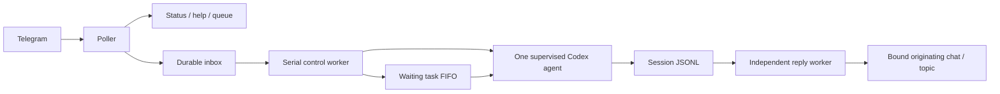

# Relay architecture and recovery

The runtime owns one Codex agent per bot. Splitting services does not create
additional agents, conversations or per-chat workers.

## Components

`scripts/telegram_inbox.py` is the compatible CLI/import entry point. The
implementation is the `scripts/teleagent` package; tests mock the module that
owns a dependency rather than a global in the old monolith.

| Component | Responsibility |
| --- | --- |
| `app`, `service` | Runtime assembly, poller, durable ingress, one serial control worker and independent outbound worker |
| `ui`, `commands` | Fast phone controls and agent/account operations |
| `routing`, `events`, `delivery` | Authorization, immutable prompt destinations, turn binding, normalization, deduplication and reply cursors |
| `replies` | Durable control-result delivery, retry backoff and independent progress for each chat/topic |
| `queue`, `submission` | FIFO, exact root-user submission checks and bounded composer recovery |
| `lifecycle`, `processes`, `sessions` | Desired lifecycle state, tmux/process identity, valid root-session discovery |
| `models`, `status` | Model selectors and observed agent state |
| `auth`, `usage` | Authentication, account recovery and rate-limit event tracking |
| `attachments`, `messages`, `identity`, `schedule` | Downloads, message formatting, scoped replay and timed work |
| `state`, `transport`, `settings` | Atomic private JSON, locks, Telegram API and configuration |

## Delivery invariants

1. Every accepted normal update is stored before the Telegram offset advances.
   A single runtime lock prevents duplicate pollers sharing the same state.
2. Exactly one worker writes to the agent composer or runs lifecycle controls.
   Status and reply delivery do not wait behind a slow model/account operation.
3. The route record is reserved before the prompt is pasted. Reusing a route ID
   cannot change its chat or topic.
4. A real Codex turn binds to its first trusted Telegram route. Later input from
   a different destination quarantines the remaining output to the owner's PM.
   Unknown routes also resolve privately; the mutable latest-chat hint cannot
   authorize a group destination.
5. Only assistant messages are forwarded. Alternate Codex event schemas are
   deduplicated by message ID and by content/phase within a turn. The turn binding
   and recent keys survive listener restart.
6. Incomplete JSONL lines wait for a later read. Failed sends retain the cursor.
   A crash between Telegram accepting a send and the local cursor commit can
   duplicate a reply: the Bot API does not provide an exactly-once transaction.
7. Group replay reads group-scoped files even if legacy private-log splitting is
   disabled. Status never includes an assistant-history preview. Group prompts
   do not inject the private per-person memory summary.
8. An uncertain inbound delivery is archived for review instead of blindly
   pasted again. Accepted but unstarted ingress survives restart in FIFO order.
9. Timed work reserves its original chat/topic and waits while the agent is busy.
   The queue never presses Escape or resumes a goal automatically.
10. A failed control-result send retries the saved reply without repeating its
    command. Failure in one destination does not block control replies to other
    chats. Partial control replies retain only their unsent chunks.
11. Delivery and maintenance failures remain visible in status until a successful
    check. Recovery failures produce a rate-limited private notice. Corrupt or
    unreadable state raises an error instead of being overwritten as empty.

State mutations use file/thread locks and atomic replacement with mode 0600 and
fsync. Each state file has one primary writer; route and queue mutations that
can overlap with phone controls use shared locks.

## Runtime files

All paths are relative to the instance's `TELEAGENT_LOG_DIR`.

| File | Purpose |
| --- | --- |
| `telegram_inbox.offset` | Last Telegram update acknowledged |
| `telegram_ingress.state.json` | Accepted incoming updates and interrupted delivery archive |
| `telegram_relay_queue.state.json` | Waiting, failed and cancelled tasks |
| `telegram_relay_confirmation.state.json` | Submitted messages awaiting a root-user event |
| `telegram_reply_route.state.json` | Prompt-to-chat/topic destination records |
| `telegram_agent_messages.state.json` | Reply cursor, active turn destination and deduplication keys |
| `telegram_health.state.json` | Control/delivery heartbeat and current control-operation age |
| `telegram_control_replies.state.json` | Pending control results and notices, with immutable destinations and retry state |
| `telegram_agent_lifecycle.state.json` | Operator's persistent running/stopped preference |
| `telegram_timed_messages.state.json` | Scheduled tasks and their delivery state |

Do not delete offsets or queues to repair a stalled bot: that can replay old
work. Use `/status` and `/queue`, inspect the exact instance's local logs, and
restart only the failed listener when its agent remains healthy. A deliberately
stopped agent stays stopped until `/start_agent`.

## Validation

`scripts/check.sh` runs the behavioral suite under a private tmux socket and
checks shell syntax. Regression coverage includes mixed PM/group turns, real
turn boundaries, forum topics, restart during delivery, duplicate schemas,
mention/reply matching, callback authorization, group-safe queue controls,
concurrent state writes, a blocked control worker with live outbound delivery,
model/account recovery and per-instance process isolation.
